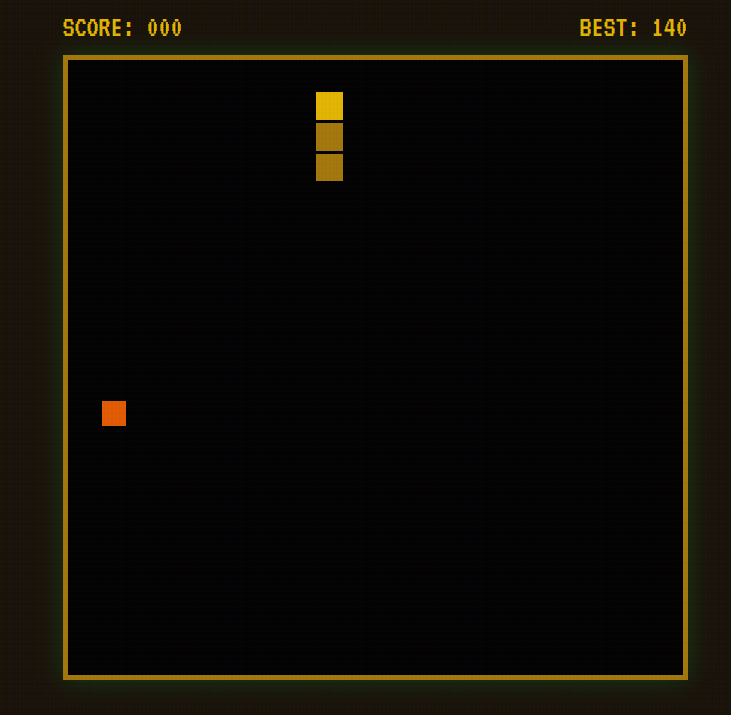

# 🐍 RETRO SNAKE GAME – Neon, Difficulty & Themes

> A classic Snake game with a retro CRT aesthetic, now featuring **difficulty levels**, **three visual themes**, and **persistent settings**.

  


---

## 🎮 Play Online

👉 **[Live Demo](https://affan675.github.io/RETRO_SNAKE_GAME/)** – *if you host it on GitHub Pages*  
Or simply open `index.html` in your browser.

---

## ✨ Features

### Original Retro Charm
- Pixel-perfect grid (20×20) with smooth snake movement.
- CRT scanline effect and neon glow.
- Classic sound effects (square wave beeps).
- High score saved in `localStorage`.

### New Upgrades 🚀
- **Difficulty Selection**  
  - 🟢 **Easy** – slower speed (150ms), 15 points per food, min speed 80ms.  
  - 🔵 **Normal** – original speed (100ms), 10 points, classic challenge.  
  - 🔴 **Hard** – faster (75ms), starts with length 4, min speed 35ms.

- **Three Visual Themes**  
  - 🟢 **Neon Retro** – green snake, red food (original).  
  - 🟣 **Cyberpunk** – magenta snake, cyan food, purple accent.  
  - 🟡 **Golden Age** – gold snake, orange food, dark goldenrod.

- **Persistent Settings**  
  - Difficulty and theme choices are saved automatically.  
  - Reload the page – your preferences are restored.

- **Bug Fixes**  
  - Hard mode now loads correctly.  
  - UI buttons highlight the saved settings after reload.

---

## 🕹️ How to Play

1. **Choose your difficulty** (Easy / Normal / Hard) on the start screen.
2. **Pick a theme** (Neon / Cyberpunk / Golden).
3. Press **PRESS START**.
4. Use **arrow keys** (↑ ↓ ← →) to control the snake.
5. Eat the red (or themed) food to grow longer and increase your score.
6. Avoid hitting the walls or your own tail.
7. Game speed increases slightly with each food eaten (until difficulty’s minimum speed).

---

## 🛠️ Installation & Local Setup

```bash
# Clone your fork
git clone https://github.com/affan675/RETRO_SNAKE_GAME.git
cd RETRO_SNAKE_GAME

# Open in VS Code (or any editor)
code .

# Launch the game
# Just open index.html in a browser
```

No dependencies, no build step – pure HTML/CSS/JS.

## 📂 Project Structure

```text
RETRO_SNAKE_GAME/
├── index.html              # Main page (start screen, game container)
├── css/
│   ├── style.css           # Original retro styling (unchanged)
│   └── enhancements.css    # New styles for difficulty/theme buttons
├── js/
│   ├── script.js           # Original game engine (untouched)
│   ├── enhancements.js     # Difficulty & theme logic + localStorage
│   └── hard_logic.js       # Hard‑mode specific fixes
└── assets/                 # (optional) images, icons
```

## 🧪 Testing
Tested on Chrome, Firefox, and Edge. Keyboard interaction is required for controls.

## 🤝 Contributing
This is a pull request to the original repository: `rajdeep292008-pixel/RETRO_SNAKE_GAME`. All changes are additive.

## 📜 Credits
Original Author: **rajdeep292008-pixel**  
Upgrades by: **affan675**  
Font: **VT323** by Google Fonts

## 📄 License
This project is open source under the MIT License.

---
Enjoy the game! 🐍✨  
If you like it, ⭐ star the repository!